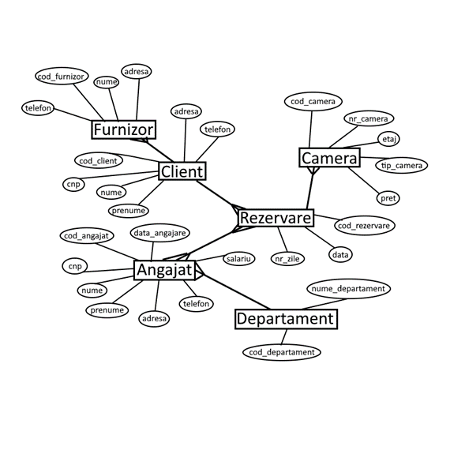

 UNIVERSITATEA „DUNĂREA DE JOS" DIN GALAȚI

FACULTATEA DE AUTOMATICĂ, CALCULATOARE, INGINERIE ELECTRICĂ ȘI ELECTRONICĂ

# Proiect Proiectarea Aplicațiilor Orientate pe Obiecte

# Gestiunea unui Hotel

Coordonator,

Cristina Elena Anton

Student,

Chitiga Alexandru Gabriel

ANUL III CTI

GRUPA 22C32 A

AN 2022-2023

#
# **Cuprins**

[1. Tema 3](#_Toc136115918)

[2. Analiza problemei 3](#_Toc136115919)

[3. Specificarea cerintelor 3](#_Toc136115920)

[4. Proiectarea la nivel conceptual: diagrame in toate relatiile 4](#_Toc136115921)

[5. Proiectarea la nivel logic: schema bazei de date relationale 5](#_Toc136115922)

[6. Proiectarea la nivel fizic: modelul fizic al datelor 5](#_Toc136115923)

[7. Tehnologii folosite: 7](#_Toc136115924)

[8. Functionalitate Aplicatie: 8](#_Toc136115925)

# 1. Tema

Gestiunea unui hotel

# 2. Analiza problemei

Indiferent de locul în care vă petreceți vacanța, aveți nevoie de un loc elegant și primitor unde să vă odihniți și să vă întoarceți împrospătat la muncă. Am ales acest subiect pentru a-i ajuta pe hotelieri și poate pentru a-i motiva pe hotelieri să documenteze mai bine ceea ce fac în hotelurile lor. În același timp, cred că sunt multe hoteluri care ar dori să beneficieze de programarea și definirea greșită a ceea ce au de făcut.

Clienții trebuie să poată face rezervări prin intermediul sistemului online. La momentul rezervării au trebuit să plătească în avans 10% din valoarea camerei și dacă nu se prezentau au renunțat la această plată în avans. Rezervările pot fi plătite cu un card de credit precum Visa sau MasterCard.

Atunci când sunt prezenți la hotel, clienții vor fi rugați să furnizeze informații despre identitatea lor, cum ar fi numele, CNP etc.

Camerele de hotel pot avea echipamente diferite. De exemplu, într-un hotel, sunt camere cu un televizor cu diagonala de 51 cm, și sunt camere cu televizor cu diagonala de 80 cm. Pe langa facilitatile camerei, clientii pot alege si se bucura de o serie de servicii suplimentare, contra cost bineinteles, precum folosirea sala de sport, piscina, tururi cu ghid de oras, room service, mic dejun, cina etc. cele mai bune conditii pentru clienti, managerul hotelului incearca sa satisfaca toate cerintele clientilor. Uneori se întâmplă ca un client să solicite un serviciu pe care hotelul nu îl poate oferi cu ajutorul personalului și al echipamentelor sale, precum plimbările cu snowmobilul. În acel moment, el este nevoit să apeleze la serviciile unui furnizor extern pentru a satisface clientul. La sfarsitul unui sejur la hotel, clientii au posibilitatea de a-si exprima opinia asupra calitatii serviciilor pe care le-au primit in timpul sejurului precum reclamatii sau laude.

# 3. Specificarea cerintelor

-Meniu de logare in aplicatie cu 2 conturi diferite:

- Admin, care ofera acces complet asupra aplicatiei si a tabelelor
- Utilizator, care ofera acces limitat, doar de vizualizare, asupra aplicatiei si a tabelelor

-Meniu principal unde putem efectua diferite tipuri de operatii precum:

- Inserare in tabela
- Modificarea liniilor din tabela
- Stergerea liniilor din tabela
- Curatarea campurilor folosite la efectuarea operatiilor pe tabela
- Operatii de cautare in tabela
- Filtrare in tabela care are loc in timp real
- Import din format .csv
- Export in format .pdf

# 4. Proiectarea la nivel conceptual: diagrame in toate relatiile

# 5. Proiectarea la nivel logic: schema bazei de date relationale

furnizor[cod\_furnizor, nume, adresa, telefon, cod\_client];

client[cod\_client, cnp, nume, prenume, adresa, telefon];

rezervare[cod\_rezervare, cod\_client, cod\_angajat, data, nr\_zile];

camera[cod\_camera, nr\_camera, etaj, tip\_camera, pret, cod\_rezervare];

angajat[cod\_angajat, cnp, nume, prenume, adresa, telefon, salariu, data\_angajare, cod\_departament];

departament[cod\_departament, nume\_departament];

# 6. Proiectarea la nivel fizic: modelul fizic al datelor

ANGAJAT:

CAMERA:

CLIENT:

DEPARTAMENT:

FURNIZOR:

REZERVARE:

# 7. Tehnologii folosite:

- C#
- SQL

**C#** este un limbaj de programare de nivel înalt SI de uz general care acceptă mai multe paradigme. C# cuprinde tastarea statică, tastarea puternică, disciplinele de programare cu scop lexical, imperative, declarative, funcționale, generice, orientate pe obiecte (bazate pe clase) și orientate pe componente.

**SQL** este un limbaj de programare specific pentru manipularea datelor în sistemele de manipulare a bazelor de date relaționale (RDBMS), iar la origine este un limbaj bazat pe algebra relațională. Acesta are ca scop inserarea datelor, interogații, actualizare și ștergere, modificarea și crearea schemelor, precum și controlul accesului la date.

# 8. Functionalitate Aplicatie:

Login:

Aplicatie in mod utilizator:

Aplicatie in mod Admin:

Proiect Proiectarea Aplicațiilor Orientate pe Obiecte
